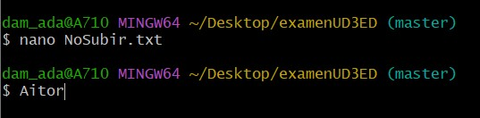
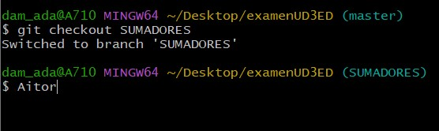
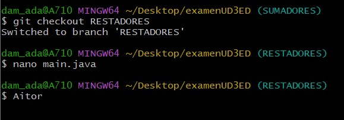
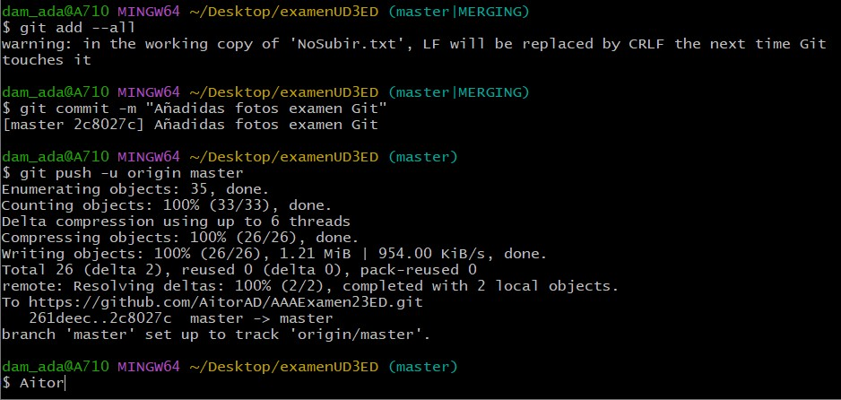

# Examen Entornos de Desarrollo 
## Tema 3: Git. 05/12/23


Nombre y apellidos: Aitor Agulló Duque

Fecha: 05/12/2023

 

LINK DEL REPOSITORIO: https://github.com/AitorAD/AAAExamen23ED.git

> Vamos a crear una primera versión de una calculadora.  
> Debajo de cada ejercicio deberá aparecer capturas de pantalla pertinentes que justifiquen su realización. Intentad hacer todo lo posible desde la consola si no se indica lo contrario. 
> Se valorará negativamente las malas prácticass de GIT 

 

**1.- (0,75) Crea un repositorio en github “AAAExamen23ED“ e invítame a colaborar: "TomBort8" . AAA serán las primeras letras de tu nombre, 1er apellido y 2º apellido respectivamente.** 


**2.- (0,75) Inicializa el repostiorio en local y vincúlalo al repostiroio de github** 


**3.- Crea un main que pida 2 números por teclado.** 

```
import java.util.Scanner; 

 

public class MostrarNumeros { 

 

    public static void main(String[] args) { 

        Scanner scanner = new Scanner(System.in); 

 

        System.out.println("Por favor, ingresa el primer número:"); 

        double numero1 = scanner.nextDouble(); 

 

        System.out.println("Ahora, ingresa el segundo número:"); 

        double numero2 = scanner.nextDouble(); 

 

        System.out.println("Los números ingresados son:"); 

        System.out.println("Número 1: " + numero1); 

        System.out.println("Número 2: " + numero2); 

 

        scanner.close(); 

    } 

} 
```


> Sube los cambios al repositorio. 


**4.- (0,2) Crea  un fichero ExplicaCalculadora.txt : “Este programa es una calculadora que va a poder realizar las operaciones básicas: sumar, restar, multiplicar y dividir”.** 


*  **4.1  (0,3)Crea también un fichero de texto que no debes subir a github pero debe estar dentro de la carpeta NoSubir.txt: (Este archivo debes añadirlo y quitarlo, como si te hubieras confundido). “Este archivo debe estar en la carpeta pero no subido a git”.**




> Muestra por comandos que no lo has subido 


> Sube los cambios al repositorio. 


**5.- (0,5) Muestra la diferencia entre los 2 últimos commits.** 


**6.- (0,5) Crea 2 ramas SUMADORES y RESTADORES** 


**7.- Sitúate en SUMADORES y añade al main lo siguiente:**

```
public static double sumar(double a, double b) { 

        return a + b; 

    } 
public static double multiplicar(double a, double b) { 

        return a * b; 

    } 

public static double potencia(double base, double exponente) { 

        return Math.pow(base, exponente); 

    }  
```




> Sube los cambios al repositorio.


**8.- Sitúate en RESTADORES y añade al main lo siguiente:**

```
public static double restar(double a, double b) { 

        return a - b; 

    } 

public static double dividir(double a, double b) { 

        if (b != 0) { 

            return a / b; 

        } else { 

            throw new IllegalArgumentException("No se puede dividir por cero"); 

        } 

    } 

public static double raizCuadrada(double a) { 

        if (a >= 0) { 

            return Math.sqrt(a); 

        } else { 

            throw new IllegalArgumentException("No se puede calcular la raíz cuadrada de un número negativo"); 

        } 

    } 
```




> Sube los cambios al repositorio. 


**9.- (1) Muestra la diferencia entre las ramas sumadores y restadores y guárdalo en un fichero llamado DIFERENCIA _RAMAS (desde consola). Este ficehro debe subirse al repositorio.** 


**10.- (1,5) Fusiónalo en main (consola) y resuelve el conflicto (en gitHUB).** 


> Sube los cambios al repositorio. 

 

**11.-(0,5) Borra las ramas SUMADORES Y RESTADORES.**

 

**12.- (0,5) entra a SOURCETREE y haz una captura del eje temporal del repositorio. Haz una breve explicación de lo que observas.** 


**13.- (1) ¿ Cuál es la diferencia entre “git pull” y “git clone” ?** 
> Git clone clona un repositorio ya existente. El git pull sirve para "actualizar" los cambios de un repositorio que tienes en local.
 

 

**14.- (1) Abre el main y déjalo inservible. Sube los cambios. Deshaz el último commit.**
 

**15.- (1) Vuelve al estado en el que estaba el proyecto al acabar el ejercicio 3 en local.**
 
 
 **16.-(0,5) Añade este documento al repoitorio, con todas las imágenes para que se pueda ver desde git.**



> El archivo ya lo tenia en seguimiento desde el principio del examen

**17.- Por último, ejecutad el siguiente comando:** 

> *history > historial.txt* 

**sube el resultado a aules junto al PDF de este documento.** 